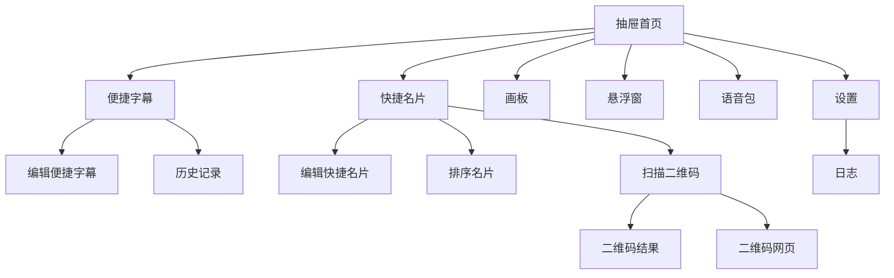

# KIGTTS 安卓端主软件功能与界面设计

> 当前主名称为 **KIGTTS**。`KGTTS` 为历史名称，仅用于兼容说明或旧路径引用。

本文档整理当前安卓主软件的功能模块、界面结构、交互逻辑、实现架构、文件格式与系统集成能力，作为后续开发、测试、开源说明和 UI 对齐的统一基线。

## 1. 产品定位与总览

KIGTTS 安卓端是一款以**离线语音识别（ASR）+ 离线语音合成（TTS）**为核心的多功能沟通工具，当前已经发展为 6 个一级模块：

- 便捷字幕
- 快捷名片
- 画板
- 悬浮窗
- 语音包
- 设置

主能力不是单纯“语音转文字”，而是围绕**快捷沟通、辅助表达、离线运行、系统级快速触达**展开：

- 用便捷字幕快速上屏大字幕、快捷文本和历史记录
- 用快捷名片展示二维码、文字或图片名片
- 用画板进行手写/绘制并保存
- 用悬浮窗在应用外直接调用快捷字幕与快捷名片
- 用语音包系统管理离线音色包，并与训练器导出格式联动
- 用设置页统一管理识别、音频、资源、系统集成能力

### 1.1 技术栈与核心依赖

- UI：Kotlin + Jetpack Compose
- ASR：`sherpa-onnx`（SenseVoice 路线，结合 Silero VAD / 标点模型）
- TTS：系统 TTS（默认）+ Piper ONNX（可导入语音包）
- 软件降噪：RNNoise / Speex
- 说话人验证：sherpa-onnx 官方 speaker embedding 模型
- 二维码：相机扫码 + 文本/网页分流
- 画板：Compose 画布 + 自定义工具栏
- 悬浮窗：`SYSTEM_ALERT_WINDOW` + 独立前台服务
- 文件接管：`.kigvpk` / 分享导入 / `FileProvider`

### 1.2 核心代码入口

- UI 与主导航：`android-app/app/src/main/java/com/kgtts/app/ui/MainActivity.kt`
- 音频引擎：`android-app/app/src/main/java/com/kgtts/app/audio/Engines.kt`
- 降噪与录测：`android-app/app/src/main/java/com/kgtts/app/audio/NoiseProcessors.kt`
- 模型与语音包：`android-app/app/src/main/java/com/kgtts/app/data/ModelRepository.kt`
- 偏好与持久化：`android-app/app/src/main/java/com/kgtts/app/data/UserPrefs.kt`
- 悬浮窗：`android-app/app/src/main/java/com/kgtts/app/overlay/FloatingOverlayService.kt`

## 2. 界面信息架构

### 2.1 一级页面（抽屉顺序）

当前左侧抽屉的一级页面顺序与代码一致：

| 顺序 | 页面 | 作用 |
| --- | --- | --- |
| 1 | 便捷字幕 | 快速上屏字幕、快捷文本、历史记录 |
| 2 | 快捷名片 | 名片浏览、预览、编辑、扫码 |
| 3 | 画板 | 手写/绘制/保存 |
| 4 | 悬浮窗 | 悬浮窗状态与同步设置入口 |
| 5 | 语音包 | 语音包导入、启用、分享、删除 |
| 6 | 设置 | 全局资源、识别、音频、系统设置 |

### 2.2 二级页面与子路由

#### 便捷字幕

- `quick_subtitle/main`：主页面
- `quick_subtitle/editor`：编辑便捷字幕
- `quick_subtitle/history`：历史记录

#### 快捷名片

- `quick_card/main`：主页面
- `quick_card/editor`：编辑快捷名片
- `quick_card/sort`：排序名片
- `quick_card/scanner`：扫描二维码
- `quick_card/scan_text/{text}`：二维码结果
- `quick_card/web/{url}`：二维码网页

#### 设置

- `settings/main`：主设置页
- `settings/log`：日志页

### 2.3 导航关系图



### 2.4 标题栏动作区

标题栏是当前应用的重要交互总线，不同页面会切换右上角动作区，但切换逻辑统一由主 UI 管理：

- 便捷字幕主页：运行状态条按钮、语音/播放相关按钮、大字幕全屏按钮
- 快捷名片主页：新建名片、扫码
- 快捷名片编辑页：复制、删除
- 快捷名片排序页：确认保存排序
- 快捷名片网页页：更多菜单（浏览器打开、复制链接、分享、刷新、前进、后退）
- 画板：保存、全屏、折叠工具栏等
- 语音包：导入按钮
- 设置：日志入口；日志页则切换为日志操作按钮

标题栏标题本身使用淡入淡出切换，不再依赖尺寸变化动画。

## 3. 模块级功能与界面设计

### 3.1 便捷字幕

#### 功能目标

- 以最快路径把文本显示为大字幕
- 支持快捷文本、手输、语音识别、按住说话等多种输入方式
- 支持朗读、历史记录、全屏预览和悬浮窗联动

#### 主界面布局

- 大字幕区：当前主要显示内容
- 缩放滑条：调节大字幕字号
- 快捷文本区：按分组浏览并点击发送
- 分组切换区：竖屏为底部/横排切换，横屏为右侧竖向切换
- 底栏：返回、前进、朗读、历史记录、发送/输入
- FAB：普通发送模式或 PTT 模式的主按钮

#### 横竖屏/平板适配

- 竖屏：大字幕在上，快捷文本在中，底栏与 FAB 在下
- 横屏：大字幕在左，快捷文本与分组切换在右，底栏横向收口
- 大屏下卡片有最大宽度和阴影样式控制，避免无限拉宽

#### 关键交互

- 点击快捷文本：统一走“快捷文本提交”链路，更新大字幕、历史、是否朗读
- 点击大字幕：弹出预览浮窗；长按可复制
- 清屏：显示占位文本（默认“我不太方便说话，请等我一下……”）
- 底栏开关：朗读开关会同时影响快捷文本与手输发送
- 历史记录：从便捷字幕进入二级页查看，支持长按复制

#### 语音相关

- 支持开关模式持续识别
- 支持按住说话（PTT）
- 支持按住说话确认模式：
  - 主界面与悬浮窗分别独立显示
  - 流式识别结果显示于确认区
  - 松手时按目标区域决定上屏、取消或其它动作
- ASR 结果可配置为自动上屏到便捷字幕

#### 动画与状态

- 大字幕弹窗与返回带预览切换动效
- 标题栏状态条常驻，可手动展开/收起
- 快捷文本分组切换在横竖屏下使用不同方向的内容切换动画

#### 实现入口

- `MainActivity.kt`
- `Engines.kt`
- `UserPrefs.kt`

### 3.2 快捷名片

#### 功能目标

- 管理可翻页的快捷名片集
- 支持图片名片、二维码名片、文字名片
- 支持扫码、网页跳转、长按编辑、弹窗预览、分享

#### 名片类型

| 类型 | 主要内容区 | 补充信息区 |
| --- | --- | --- |
| 图片名片 | 图片或横竖屏适配图片 | 标题、备注、链接/分享（可选） |
| 二维码名片 | 二维码 | 标题、备注、链接、分享 |
| 文字名片 | 大号装饰文本 + 主题色块 | 标题、备注、链接、分享 |

#### 主界面布局

- 名片翻页主区域：左右翻页
- 页面指示器：竖屏在下，横屏也统一在下
- 空白占位卡：最后一张固定为“点击以新建名片”
- 点击卡片：进入预览弹窗
- 长按卡片：进入对应编辑/跳转逻辑

#### 横竖屏差异

- 竖屏：内容区为竖向比例，标题与说明位于内容区下方信息区
- 横屏：内容区和信息区左右排布
- 文字名片装饰文字在横竖屏下有不同的锚点与裁切方式

#### 二级页面

- 编辑快捷名片：类型切换、标题、备注、主题色、链接、图片/横屏图片
- 排序名片：拖动排序，顶部确认按钮保存返回
- 扫码页：实时预览连续扫码
- 二维码结果页：非链接文本可复制/分享
- 二维码网页页：内置 WebView 打开，并提供更多菜单

#### 编辑与持久化规则

- 三种名片类型使用统一数据结构，只是编辑页面显示项不同
- 图片缺失时可按规则回退到二维码/文字名片
- 退出编辑支持自动保存与弹窗确认
- 复制名片与删除名片都在编辑页顶部完成

#### 实现入口

- `MainActivity.kt`
- `UserPrefs.kt`

### 3.3 画板

#### 功能目标

- 在安卓端提供快速手写板/草图板
- 支持手绘、缩放、拖动、全屏与保存

#### 主界面布局

- 画布卡片：以“纸张/卡片”形式承载绘制区域
- 工具栏：画笔、橡皮、清除、颜色、笔刷大小、全屏等
- 折叠工具栏：可从完整工具栏切换为小型悬浮工具条

#### 横竖屏/全屏

- 竖屏：工具栏居底居中
- 横屏：工具栏居右居中
- 全屏：隐藏顶部栏/状态栏，内容区域与工具条重新适配

#### 交互能力

- 单指绘制
- 双指缩放与移动画布
- 保存到相册/自定义路径
- 画板保存路径可在设置中配置

#### 实现入口

- `MainActivity.kt`
- `UserPrefs.kt`

### 3.4 悬浮窗

#### 功能目标

- 在软件外直接访问快捷字幕、快捷名片和快捷方式
- 以最少层级提供字幕、名片、PTT 和快捷启动入口

#### 组成

- 悬浮 FAB：
  - 展开主面板
  - 可吸附到屏幕边缘
  - 可自动贴边并半透明收纳
- 启动器页：
  - 图标网格
  - 支持添加第三方应用快捷方式
  - 长按进入编辑模式、删除、自定义排序
- 迷你快捷字幕：
  - 顶栏
  - 大字幕卡片
  - 快捷文本区
  - 右侧分组切换器
  - 底栏
- 迷你快捷名片：
  - 名片翻页
  - 预览弹窗
  - 长按回主软件对应名片
- 悬浮窗 PTT：
  - 与主软件音频主链路联动
  - 悬浮窗只负责 UI 和控制入口

#### 启动器页能力

- 内置入口：快捷字幕、快捷名片、画板、二维码扫描、设置等
- 第三方应用：
  - 支持读取 launcher app
  - 支持长按读取标准 shortcuts 菜单
  - 支持排序与跨页拖动

#### 视觉与交互

- 顶栏、主体卡片、底栏、FAB 使用统一自定义阴影
- 收纳态与展开态支持动画
- 迷你快捷字幕支持从启动器过渡到字幕页的分阶段展开动效
- 悬浮窗周围点击空白可收起

#### 实现入口

- `FloatingOverlayService.kt`
- `MainActivity.kt`
- `UserPrefs.kt`

### 3.5 语音包

#### 功能目标

- 统一导入、校验、管理、分享 Piper 音色包

#### 页面能力

- 列表：显示所有音色包
- 详情：查看元信息、头像、备注
- 启用：切换当前音色包
- 分享：导出为 `.kigvpk`
- 删除：移除本地音色包
- 导入：支持应用内选择器与外部打开安装

#### 当前格式策略

- 导入支持：
  - `.zip`
  - `.kigvpk`
- 分享输出：
  - `语音包名称.kigvpk`

#### 校验规则

语音包导入前必须至少满足：

- `manifest.json`
- `tts/model.onnx`
- `tts/model.onnx.json`
- `tts/phonemizer.dict`

若 `manifest.json` 中 `files.model / files.config / files.phonemizer` 缺失或指向文件不存在，则拒绝导入。

#### 外部接管

- 支持从文件管理器/聊天软件直接点开 `.kigvpk`
- 支持 `ACTION_SEND` 分享导入

#### 实现入口

- `ModelRepository.kt`
- `MainActivity.kt`

### 3.6 设置

#### 功能目标

- 用单页分组方式承载所有系统配置，并在手机/平板上自适应

#### 分类

| 分类 | 主要内容 |
| --- | --- |
| 资源 | ASR 模型、语音包、文件资源相关 |
| 识别 | 自动上屏、说话人验证、数字替换、识别相关开关 |
| 音频 | 设备、增益、降噪、AEC、音频测试 |
| 系统 | 抽屉/主题/内建文件管理器/内建图库/保存路径/后台相关 |

#### tabs 设计

- 窄屏：顶部图标-only tabs，选中态为下划线
- 宽屏：左侧 rail，图标+文字，选中态为右侧竖线
- 超宽屏：内容区域进一步居中并限制最大宽度

#### 设置项样式

- Toggle：全宽行，标题左、开关右，整行可点击
- Dropdown：全宽行，标题、当前值、箭头同一行，整行可点击
- 菜单：统一使用淡入/缩放、对称退出动画

#### 重点子能力

- 软件降噪：关闭 / RNNoise / Speex
- 音频测试：录制、回放、清空、状态、电平
- 说话人验证：启用、注册、删除、阈值
- 悬浮窗：状态与同步说明
- 画板保存路径
- 内建文件管理器 / 内建图库
- 名片编辑自动保存

#### 实现入口

- `MainActivity.kt`
- `NoiseProcessors.kt`
- `UserPrefs.kt`

## 4. 共用能力与实现说明

### 4.1 音频链路

当前音频主链路由主软件统一负责，悬浮窗侧不再独立持有第二套音频引擎。

- 麦克风采集
- ASR 识别
- TTS 合成
- 播放队列
- 历史记录写入
- 设备选择与路由
- 回声与通信模式相关控制

### 4.2 软件降噪

当前支持三种模式：

- 关闭
- RNNoise 噪声抑制
- Speex 噪声抑制

这些模式会进入设置页“音频”分类统一配置，并与音频引擎联动。

### 4.3 音频测试

设置页提供音频测试卡片，可用于快速确认当前麦克风与回放链路：

- 开始录制
- 结束录制
- 回放录制结果
- 清空测试片段
- 显示状态与当前电平

### 4.4 说话人验证

- 支持最多 3 个说话人
- 未注册时打开验证会触发注册流程
- 当前底层使用 sherpa-onnx 官方说话人验证模型：
  - `speaker_verify/3dspeaker_speech_campplus_sv_zh-cn_16k-common.onnx`
- 注册流程为分步引导式弹窗：
  - 准备页
  - 3 句逐句朗读页
  - 结果页
- 注册过程中带倒计时、进度、实时音量条
- 支持清除全部注册信息或删除单个说话人

### 4.5 文件与资源

- ASR 模型导入：`sosv.zip` / `sosv-int8.zip`
- 语音包导入：`.zip` / `.kigvpk`
- 默认朗读后端：系统 TTS
- APK 内置资源：
  - `sosv-int8.zip`（含 SenseVoice、Silero VAD、中文/英文标点模型）
  - `speaker_verify/3dspeaker_speech_campplus_sv_zh-cn_16k-common.onnx`
  - `espeak-ng-data.zip`
- 内建文件管理器：
  - 搜索
  - 排序
  - 适合系统文件管理器不可用场景
- 内建图库：
  - 相册选择
  - 默认按时间排序（新在前）

### 4.6 二维码与 WebView

- 扫码到链接：进入 WebView
- 扫码到普通文本：进入二维码结果页，可复制/分享
- WebView 页更多菜单：
  - 浏览器打开
  - 复制链接
  - 分享
  - 刷新
  - 返回上一页
  - 前进下一页

### 4.7 系统能力

安卓主软件当前显式使用或接管的系统能力包括：

- 麦克风权限
- 相机权限
- 通知权限
- 前台服务
- 悬浮窗权限
- 文件分享与 `FileProvider`
- `.kigvpk` 外部文件打开
- `SEND` 分享接收

### 4.8 主题与视觉

- 以卡片化界面为主
- 顶部折叠状态条作为语音/播放/设备状态入口
- 设置页 tabs 已切换到近似 MD2 的无背景风格
- 部分关键卡片、FAB、悬浮窗已使用自定义阴影替代平台光源阴影

## 5. 文件格式、数据与外部接口

### 5.1 ASR 模型导入格式

- `sosv.zip`
- `sosv-int8.zip`

当前推荐的 `sosv-int8.zip` 资源包内包含：

- `sensevoice/model.int8.onnx`
- `sensevoice/tokens.txt`
- `silero_vad.onnx`
- `punct/model.int8.onnx`
- `punct-en/model.int8.onnx`

### 5.2 语音包格式

导入兼容：

- `.zip`
- `.kigvpk`

分享输出统一为：

- `.kigvpk`

默认情况下，安卓端不内置 Piper 语音包，首次运行直接使用系统 TTS。导入自定义语音包后，才会切换到 Piper 路线。

最小合法结构：

```text
manifest.json
tts/model.onnx
tts/model.onnx.json
tts/phonemizer.dict
```

### 5.3 快捷名片数据

快捷名片统一使用同一套数据结构，区分类型：

- `image`
- `qr`
- `text`

主要字段包括：

- `id`
- `type`
- `title`
- `note`
- `themeColor`
- `link`
- `imagePath`
- `landscapeImagePath`

### 5.4 外部打开与分享

主 Activity 已接管：

- `VIEW` / `OPENABLE` 打开 `.kigvpk`
- `SEND` 分享的 `.kigvpk`
- `SEND` 分享的 `application/zip`
- `SEND` 分享的 `application/octet-stream`

## 6. 实现架构与代码入口

### 6.1 UI 与导航

`MainActivity.kt`

- 承载主导航、抽屉、二级页路由、标题栏动作区
- 管理便捷字幕、快捷名片、画板、设置等 Compose 页面
- 管理页面级状态、弹窗、预览与全局交互

### 6.2 音频主链路

`Engines.kt`

- ASR/TTS 初始化与调度
- 音频采集与播放
- 识别结果输出
- 历史记录写入
- PTT / 说话人验证 / 设备切换相关主逻辑
- SenseVoice、Silero VAD、系统 TTS / Piper 双后端、sherpa 说话人验证模型接线

### 6.3 降噪与录测

`NoiseProcessors.kt`

- RNNoise / Speex native 包装
- 音频测试录制与回放
- 电平状态输出

### 6.4 模型与语音包管理

`ModelRepository.kt`

- 导入 ASR 模型
- 导入/校验语音包
- 列出、更新、删除、打包分享语音包
- `.zip` / `.kigvpk` 文件名与结构处理

### 6.5 偏好与配置

`UserPrefs.kt`

- 全局设置的持久化
- 说话人验证、降噪、悬浮窗、内建文件管理器/图库等偏好

### 6.6 悬浮窗

`FloatingOverlayService.kt`

- 独立悬浮 FAB 与面板
- 迷你快捷字幕 / 迷你快捷名片 / 启动器
- 悬浮窗排序、快捷方式、长按菜单
- 悬浮窗与主软件之间的跳转和状态同步

## 7. 当前实现基线总结

当前 KIGTTS 安卓端已经不是单页语音工具，而是一套围绕**离线识别、离线朗读、系统级快捷表达、悬浮交互、二维码/网页桥接、名片展示与画板辅助表达**构成的完整主软件。

后续任何涉及以下内容的改动，都应同步更新本文件：

- 抽屉顺序
- 页面命名与二级路由
- 语音包格式
- 设置页分类
- 悬浮窗模式
- 语音链路与降噪能力
- 文件接管与外部接口
