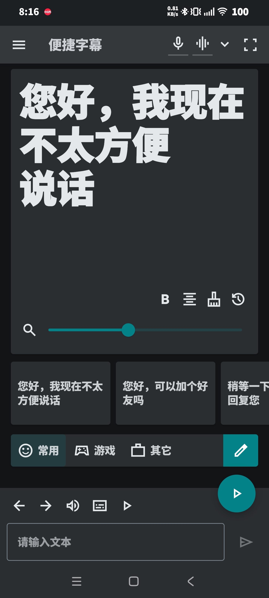
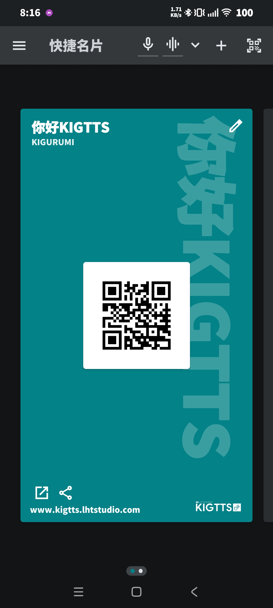
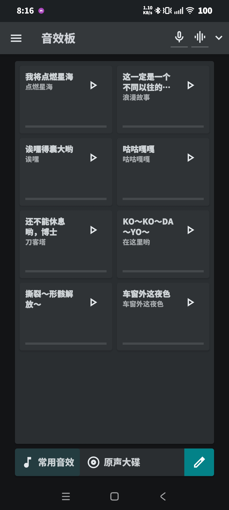
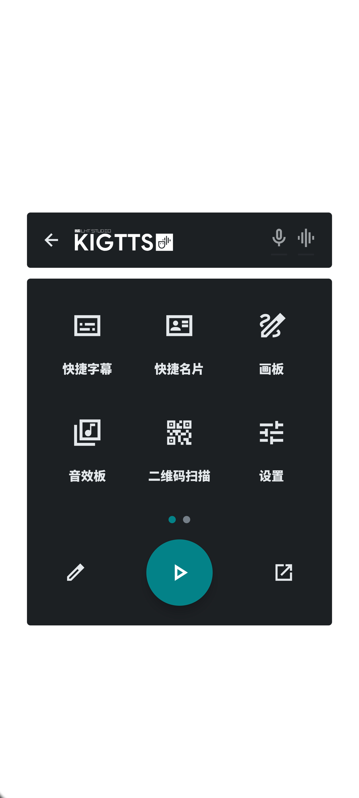
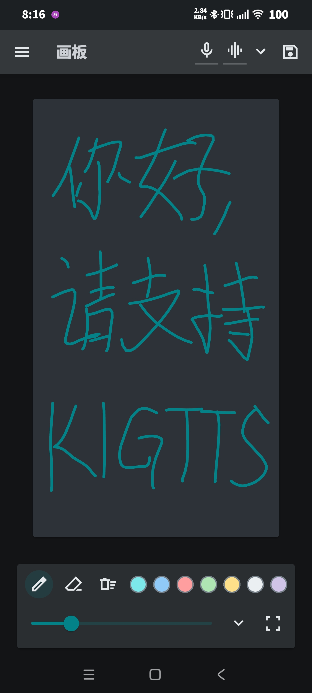
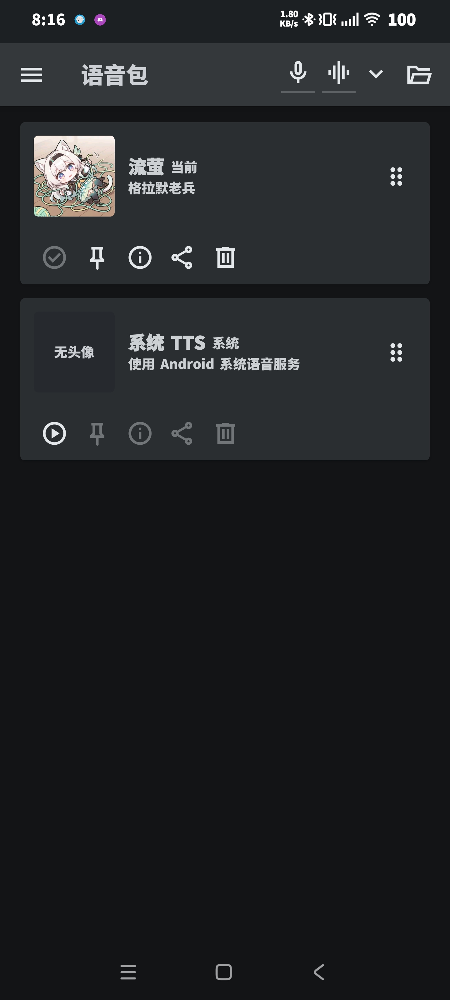

<p align="center">
  <picture>
    <source media="(prefers-color-scheme: dark)" srcset="./ARTS/LOGOWhite.svg">
    
  </picture>
</p>

<p align="center">
  面向 Kigurumi 玩家、漫展用户和不方便说话场景的现场交流辅助工具
</p>

# KIGTTS

KIGTTS 是一套面向 **Kigurumi 玩家、漫展用户和不方便说话场景** 的现场交流辅助工具。项目以 Android 端为当前主线，围绕实时字幕、语音朗读、快捷文本、名片展示、音效互动和悬浮窗快捷操作，提供一套适合漫展跑场、角色互动和低负担交流的轻量工具箱。

> 项目曾使用 `KGTTS` 作为旧称，当前统一使用 **KIGTTS**。

<p align="center">
  
  
  
  
</p>

## 项目定位

KIGTTS 不是单一的“语音转文字”工具，而是把漫展现场常见的几类需求整合在一起：

- 不方便直接说话时，用大字幕进行交流
- 需要快速展示身份、二维码、主页或社交信息
- 需要用固定台词、TTS 和音效活跃气氛
- 需要在微信、QQ、相机等其他 App 上方快速调出辅助功能
- 需要在嘈杂环境中尽量提升识别稳定性
- 需要用“语音转文字再转语音”的方式实现简易变声和扩音

如果你的使用场景是 Kigurumi、头套、面具、舞台妆造、漫展跑场、摊位互动或现场整活，KIGTTS 的目标就是尽量减少频繁切 App、现场打字慢、外放不方便和操作路径过长的问题。

## Android 软件

`android-app/` 是当前主要维护和发版的 Android 客户端，技术栈为 Kotlin + Jetpack Compose。

Android 端主要能力包括：

- 本地实时语音识别
- 系统 TTS 与本地语音包朗读
- 便捷字幕与快捷文本
- 快捷名片、二维码与链接展示
- 音效板与关键词触发
- 画板与现场手写辅助
- 悬浮窗、迷你控件与音量热键
- 微信 / QQ / 支付宝等常见扫码场景联动
- AI 语音增强、VAD、说话人验证与音频测试
- 简易变声器式使用链路：语音识别转文字，再通过 TTS 发声
- 预设、语音包、音效包的导入 / 导出 / 分享

### 便捷字幕

便捷字幕是 Android 端的核心交流页面之一。

它支持语音识别上屏、手动输入、快捷文本、TTS 朗读、大字幕预览、字体缩放、横竖屏布局和预设导入导出。常用语可以提前分组保存，在现场一键发送、上屏或朗读。

典型用途：

- “可以合影吗？”
- “稍等一下，我马上回复你”
- “谢谢你，辛苦了”
- 跑场时快速与摄影、路人、同伴沟通

### 快捷名片

快捷名片用于展示个人信息、角色信息、链接和二维码。

名片支持横竖屏展示、背景图、主题色背景、装饰文字、链接按钮、分享按钮和多张名片切换。它适合用于互关、展示主页、展示群入口、展示约拍信息或临时说明。

### 音效板

音效板用于播放短音频、接梗、做反应音和制造现场气氛。

主要能力：

- 按分组管理音效
- 支持列表和多列宫格布局
- 支持手动点击播放 / 停止
- 支持关键词触发音效
- 支持导入常见音频格式并转码为 AAC
- 支持音效板预设导入、导出和分享

字幕、TTS 和音效板可以组合使用：识别结果或快捷文本中出现唤醒词时，可以自动触发对应音效。

### 画板

画板用于现场手写、涂鸦和快速示意。

它适合在环境嘈杂、手动说明更快、或者需要画箭头、路线、表情和关键词的时候使用。

### 悬浮窗与热键

悬浮窗是 KIGTTS 区别于普通字幕工具的重要部分。

它可以在其他 App 上方常驻，并快速打开：

- 便捷字幕
- 快捷名片
- 画板
- 音效板
- 迷你快捷字幕
- 迷你快捷名片
- 常用第三方应用和快捷方式

悬浮窗支持折叠、贴边、展开和横竖屏适配。音量键序列热键可用于快速触发指定功能；在开启无障碍辅助后，部分热键和直达操作会更稳定。

### 语音、识别与增强

Android 端内置了多种音频相关能力，用于适应复杂现场环境：

- 本地 ASR：用于实时语音识别
- TTS：默认可使用系统 TTS，也支持导入本地语音包
- AI 语音增强：支持 GTCRN、DPDFNet 等增强模式
- VAD：支持阈值式 VAD、SileroVAD 和混合 VAD
- 说话人验证：减少他人说话误触发
- 音频测试：用于预览输入、降噪和语音增强效果

这些功能适合在漫展、商场、地铁站、场馆走廊等噪声较多的环境中进行调试和使用。

### 简易变声器与扩音链路

KIGTTS 也可以作为一种“简易变声器”使用：它不是传统的低延迟实时变声，而是通过 **语音识别 -> 文本 -> TTS 朗读** 的链路，把用户说的话转成另一种声音输出。

一种典型使用方式是：

- 在头壳内放置无线麦克风，用于采集自己的声音
- 在腰部或包内连接扩音器，用于播放 TTS 输出
- 通过设备路由功能选择合适的输入 / 输出设备
- 开启说话人验证，减少旁人说话误触发
- 使用音频增益提高 TTS 外放音量
- 配合降噪、AI 语音增强和 VAD，在漫展噪声环境中提升识别可用性

这条链路更适合“可接受短暂延迟，但希望声音由 TTS 代替本人发声”的场景，例如头套内说话不方便、声音容易被闷住、需要统一角色声音或需要更响亮外放时。

## 界面预览

| 便捷字幕 | 快捷名片 | 音效板 |
| --- | --- | --- |
|  |  |  |

| 悬浮窗 | 画板 | 语音包 |
| --- | --- | --- |
|  |  |  |

### 扫码与第三方联动

Android 端内置二维码扫描，并针对常见国内使用场景做了联动：

- 普通二维码扫描
- 微信二维码跳转微信处理
- QQ 二维码跳转 QQ，满足条件时可直达 QQ 扫一扫
- 支付宝二维码跳转支付宝扫一扫
- 悬浮窗启动器可挂载常用第三方应用和快捷方式

### 预设与分享

软件支持把常用内容打包保存，便于备份、迁移和分享：

- 便捷字幕预设：`.kigtpk`
- 音效板预设：`.kigspk`
- 语音包：`.kigvpk`

这可以让用户提前准备一套漫展用快捷文本、角色音效包和语音包，然后在不同设备之间迁移。

## Electron 训练端

`Electron_Trainer/` 是配套的桌面训练端，用于制作和整理 Android 端可导入的语音包。

它基于 Electron + React + Python 后端，主要用于：

- 管理训练素材
- 调用本地训练 / 处理流程
- 生成可供 Android 端导入的语音包
- 打包输出 `.kigvpk` 或兼容格式

对于只使用系统 TTS 的用户，Electron 训练端不是必需项；对于希望制作自定义语音包、整理训练素材或进行本地训练流程的用户，它是 Android 端的配套工具。

## 仓库结构

```text
android-app/        Android 主客户端，当前主要维护和发版的实现
Electron_Trainer/  Electron 训练端，用于制作和整理语音包
pc_trainer/        Python 训练器与底层训练流程
docs/              Android、法律文本和项目文档
ARTS/              图标、头像和美术素材
tools/             辅助脚本与工具
flutter_app/       并行 Flutter 试验实现，不作为当前 Android 主线
```

更多 Android 端说明：

- [Android App 说明](./android-app/README.md)
- [Android 用户功能介绍](./docs/android/ANDROID_USER_FEATURES.md)
- [模型与素材说明](./MODEL_ASSETS.md)

## 快速开始

### 构建 Android App

```bash
cd android-app
./gradlew assembleDebug
```

Windows PowerShell 下也可以使用：

```powershell
cd android-app
.\gradlew.bat assembleDebug
```

APK 输出目录：

```text
android-app/app/build/outputs/apk/
```

### 启动 Electron 训练端

```bash
cd Electron_Trainer
npm install
npm run dev
```

打包训练端：

```bash
cd Electron_Trainer
npm run dist
```

## 模型与资源

项目涉及 ASR、TTS、语音增强、说话人验证、音效和语音包等资源。部分资源体积较大，不一定全部直接放在仓库中。

请查看：

- [MODEL_ASSETS.md](./MODEL_ASSETS.md)

Android 端可用资源包括：

- ASR 模型：`sosv.zip` / `sosv-int8.zip`
- 语音包：`.kigvpk` 或兼容 `.zip`
- 语音增强模型：GTCRN / DPDFNet
- 说话人验证模型
- `espeak-ng-data`

## 隐私与离线使用

KIGTTS 的 Android 端以本地处理为核心。语音识别、语音增强、说话人验证和本地语音包朗读等能力优先在设备侧完成。

需要注意：

- 使用系统 TTS 时，实际朗读行为可能受设备系统 TTS 引擎影响
- 使用第三方 App 跳转、扫码联动或分享功能时，会进入对应第三方应用的处理流程
- 开启悬浮窗、相机、麦克风、文件选择、无障碍等权限时，权限用途与对应功能相关

隐私政策与许可证文本位于：

- [隐私政策](./docs/legal/PRIVACY_POLICY.md)
- [开源许可证说明](./docs/legal/OPEN_SOURCE_LICENSES.md)

## 许可证

项目源码采用 `GNU GPL v3.0`。

- [LICENSE](./LICENSE)
- [COPYING](./COPYING)
- [NOTICE](./NOTICE)
- [THIRD_PARTY_LICENSES.md](./THIRD_PARTY_LICENSES.md)

第三方模型、训练资源、系统组件和依赖库可能具有各自的许可证或使用条件，请在分发、商用或二次开发前分别确认。
